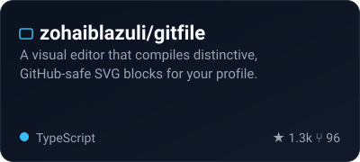
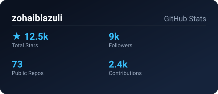
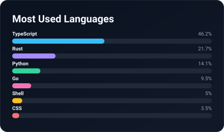
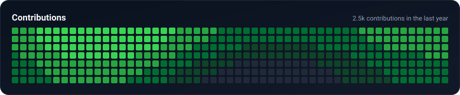

[README.md](https://github.com/user-attachments/files/29445180/README.md)
<!-- Generated by GitHub Profile Studio -->

# test 1

<picture><source media="(prefers-color-scheme: dark)" srcset="assets/header-dark.svg" /><source media="(prefers-color-scheme: light)" srcset="assets/header.svg" /></picture>

  

  

  

  

  

  

